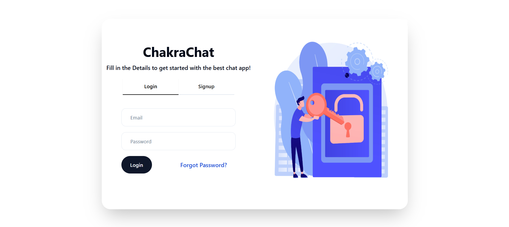
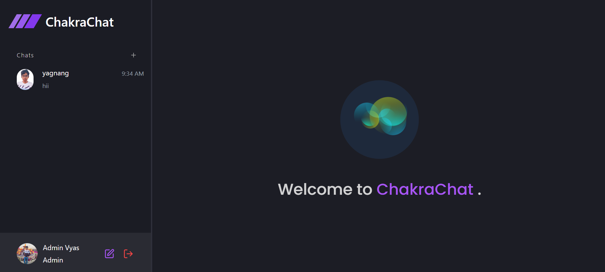
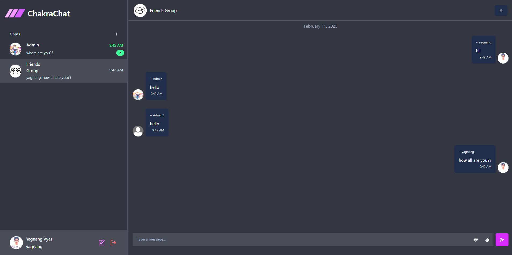
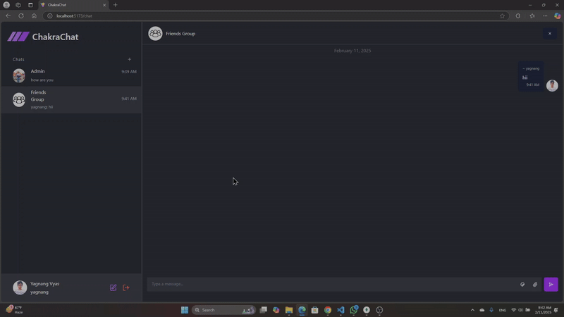
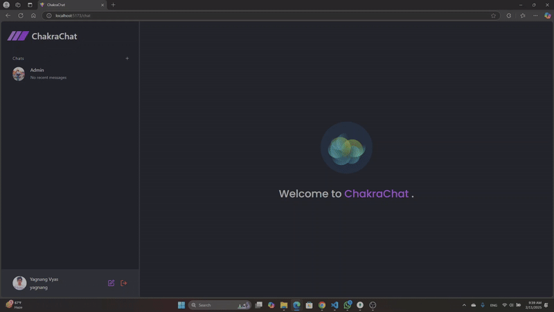

# Title

Real-Time Chat Application

## Demo Link

https://chakrachat.netlify.app

## Table Of Contents:

- [About](#about-the-app)
- [Technologies](#technologies)
- [Setup](#setup)
- [Screenshots](#screenshots)

## About The App:

This is a **real-time chat application** built using the **MERN stack** with **MongoDB, Express, React, and Node.js**, utilizing **Prisma ORM** for database management. The application supports both **one-on-one** and **group chats**, along with **media sharing** capabilities.

### ✨ Features
- ✅ **User Authentication** – Secure signup & login with email verification
- ✅ **Real-Time Messaging** – Instant chat functionality with WebSockets
- ✅ **Group & Private Chats** – One-on-one and group conversations
- ✅ **Media Sharing** – Support for text, images, and file attachments
- ✅ **Read Receipts** – Track message views
- ✅ **Scalable Architecture** – Optimized database design using MongoDB & Prisma

## Technologies

Frontend: `React js`, `Typescript`, `Redux`, `React Hook Form`

Backend: `Nodejs`, `Express`, `Multer`, `Zod`

Database: `MongoDB with Prisma ORM`

Styling lib's: `Shadcn`, `Tailwindcss`

## Setup

- Download or clone repository
- run command `npm install` in frontend and backend folders
- add env variables in frontend and backend folders

### frontend Env

```js
VITE_NODE_ENV="XXXX # development | production"
VITE_BACKEND_DEVELOPMENT_URL="http://localhost:5000"
VITE_BACKEND_DEPLOYED_URL="XXXX"
```

### backend Env

```js
NODE_ENV="XXXX # development | production"
FRONTEND_ENV="XXXX # development | production"
PORT="5000"
DATABASE_URL="XXXX"

SMTP_HOST="smtp.gmail.com"
SMTP_PORT="587"
SMTP_USER="XXXX"
SMTP_PASSWORD="XXXX"

JWT_SECRET="XXXX"
JWT_EXPIRY="5d"
JWT_RESET_PASSWORD_EXPIRY="5m"

FRONTEND_DEVELOPMENT_URL="http://localhost:5173"
FRONTEND_DEPLOYED_URL="XXXX"
```

- run command `npm run dev` frontend and backend foldres

## Screenshots






